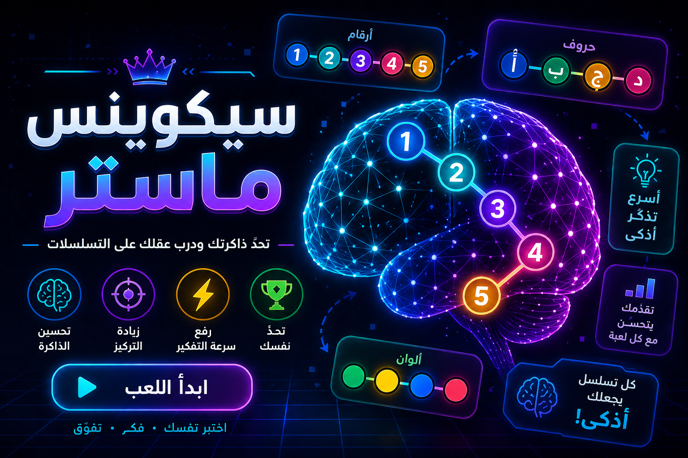

  

<h1 align="center">🧠 سيكوينس ماستر (Sequence Master)</h1>

لعبة تدريب ذهني تعتمد على التتابعات (Sequences) لتقوية الذاكرة والتركيز وسرعة التفكير

  <a href="https://majabaliuqu.github.io/Sequence-Master/">
    <strong>▶ العب الآن</strong>
  </a>

---

## 🎯 فكرة اللعبة

**سيكوينس ماستر** هي لعبة ذكية تعتمد على:
- تذكّر الأنماط (Patterns)
- متابعة التسلسلات (Sequences)
- الاستجابة السريعة

كلما تقدمت، تصبح التحديات أصعب… ويصبح عقلك أقوى.

---

## 🧩 كيف تلعب

1. يظهر لك تسلسل (أرقام / حروف / ألوان)
2. يتم إخفاء التسلسل
3. عليك إعادة إدخاله بالترتيب الصحيح
4. كل مرحلة = مستوى أصعب

---

## 🚀 مميزات اللعبة

- 🧠 تحسين الذاكرة (Memory)
- 🎯 زيادة التركيز (Focus)
- ⚡ رفع سرعة التفكير (Processing Speed)
- 🎮 تجربة لعب بسيطة لكن إدمانية
- 📈 تدرّج ذكي في الصعوبة

---

## 🎮 جرب اللعبة

👉 اضغط هنا وابدأ التحدي:  
https://majabaliuqu.github.io/Sequence-Master/

---

## 🛠️ التقنيات المستخدمة

- HTML
- CSS
- JavaScript

---

## 💡 لماذا هذه اللعبة؟

في عالم مليء بالمشتتات، تدريب العقل لم يعد رفاهية.

هذه اللعبة مصممة لتكون:
- سريعة
- ممتعة
- مفيدة فعلاً

---

## 📌 أفكار مستقبلية (Future Improvements)

- نظام نقاط (Score System)
- مستويات متعددة (Levels)
- مؤقت زمني (Timer Mode)
- حفظ التقدم (Progress Saving)
- تحديات يومية (Daily Challenges)

---

## 👨‍💻 المطور

**محمد جبلي**

---

## ⭐ دعم المشروع

إذا أعجبتك اللعبة:
- ⭐ اعمل Star للمشروع
- 🔁 شاركها مع غيرك
- 💡 اقترح تحسينات

---

🔥 كل تسلسل يجعلك أذكى

